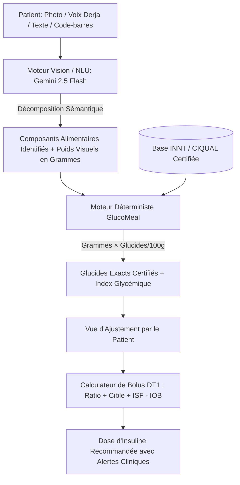

# 🥗 GlucoMeal.ai — Intelligence Artificielle & Diabétologie de Précision

> **Moteur hybride d'estimation des glucides par IA vision/voix et calcul déterministe certifié pour Diabétiques de Type 1 (DT1), spécialement calibré pour la gastronomie tunisienne et méditerranéenne.**

[](https://glucomeal-ai.vercel.app/)
[](https://glucomeal-ai.vercel.app/)
[](#)
[](#)
[](#)
[](#)
[](#)
[](#)
[](#)

---

## 📋 Sommaire

1. [Aperçu & Défi Clinique](#-aperçu--défi-clinique)
2. [L'Approche Hybride : Pourquoi Déterministe ?](#-lapproche-hybride--pourquoi-déterministe-)
3. [Fonctionnalités Principales](#-fonctionnalités-principales)
   - [4 Modalités de Saisie Multimodale](#1-quatre-modalités-de-saisie-multimodale)
   - [Ajustement Précis des Portions](#2-ajustement-précis-des-portions--validation)
   - [Calculateur de Bolus d'Insuline Sécurisé](#3-calculateur-de-bolus-dinsuline-sécurisé)
   - [Intégration Continue du Glucose (CGM / Holter)](#4-intégration-continue-du-glucose-cgm)
   - [Suivi Postprandial & Auto-Titration Algorithmique](#5-suivi-postprandial--moteur-dauto-titration)
   - [Portail Médical & Diabétologue](#6-portail-médical--diabétologue-doctor-portal)
   - [Substitutions Saines & Éducation Thérapeutique](#7-substitutions-saines--conseils-nutritionnels)
   - [Benchmark Clinique & Audit Métrologique](#8-benchmark-clinique--audit-métrologique)
   - [Exports Excel & Dossier Médical](#9-exports-cliniques-excel--rapport-pdf)
   - [Synchronisation Cloud & Télé-surveillance Parentale](#10-synchronisation-cloud--télé-surveillance)
4. [Architecture Technique & Stack](#-architecture-technique--stack)
5. [Structure du Projet](#-structure-du-projet)
6. [Installation & Démarrage](#-installation--démarrage)
7. [Variables d'Environnement](#-variables-denvironnement)
8. [Référence des Endpoints API](#-référence-des-endpoints-api)
9. [Tests & Assurance Qualité](#-tests--assurance-qualité)
10. [Sécurité & Règles Firestore](#-sécurité--règles-firestore)
11. [Avertissement Médical & Réglementaire](#-avertissement-médical--réglementaire)

---

## 🎯 Aperçu & Défi Clinique

Pour une personne atteinte de **Diabète de Type 1 (DT1)**, le comptage des glucides au gramme près avant chaque repas conditionne la dose d'insuline rapide injectée (bolus prandial). Une erreur de calcul entraîne :
- **Sous-estimation** $\rightarrow$ Hyperglycémie postprandiale sévère, fatigue, acidocétose à long terme.
- **Sur-estimation** $\rightarrow$ Hypoglycémie aiguë iatrogène potentiellement fatale.

En **Tunisie et au Maghreb**, les personnes diabétiques font face à un défi supplémentaire majeur :
- Les plats traditionnels (*Couscous, Lablabi, Ojja, Brik à l'œuf, Mlawi, Tajine tunisien, Chorba, Makroudh, Assida Zgougou...*) sont préparés de manière artisanale, sans étiquetage nutritionnel.
- Les féculents sont souvent masqués ou immergés (*pain rassis dans le bouillon du Lablabi, semoule sous les légumes et la viande du Couscous*).
- Les applications internationales ne disposent ni des recettes régionales, ni de la reconnaissance du dialecte tunisien (*Derja*), ni des tables de composition de l'**INNT** (Institut National de Nutrition et de Technologies Alimentaires de Tunis).

**GlucoMeal.ai** comble cette lacune critique en combinant la puissance de l'IA vision et voix avec un moteur clinique déterministe certifié.

---

## 🛡️ L'Approche Hybride : Pourquoi Déterministe ?

> [!IMPORTANT]
> **Règle d'or de sécurité médicale :** Les modèles de langage (LLM) sont sujets à des hallucinations statistiques et ne doivent **JAMAIS** calculer directement les grammes de glucides d'un patient diabétique.



1. **L'IA (Gemini 2.5 Flash) s'occupe de la perception :** Elle identifie visuellement les aliments constitutifs de l'assiette et estime les volumes en grammes.
2. **Le moteur déterministe certifié calcule les glucides :** Chaque composant est croisé avec la table de composition de l'INNT / CIQUAL :
   $$\text{Glucides (g)} = \frac{\text{Poids confirmé (g)} \times \text{Teneur aux 100g}}{100}$$
3. **Le patient garde le contrôle complet :** Un écran d'ajustement interactif permet de corriger immédiatement le poids de chaque composant avant la validation.

---

## 🚀 Fonctionnalités Principales

### 1. Quatre Modalités de Saisie Multimodale

| Mode | Description | Cas d'Usage |
|---|---|---|
| 📸 **Photo / Caméra** | Prise de vue sous angle à 45° ou zénithal (90°). Détection multi-composants instantanée via Gemini 2.5 Flash. | Repas complets, assiettes familiales, restaurants. |
| 🎙️ **Voix en Derja Tunisienne** | Saisie vocale avec compréhension du dialecte tunisien (ex: *"Sahn couscous bel khadhra w lham djeja w gazouza sghira"*). | Repas pris sur le pouce, enfants, personnes âgées. |
| ⌨️ **Saisie Texte Naturel** | Description libre en français ou arabe avec extraction automatique des quantités. | Repas simples ou corrections manuelles rapides. |
| 🏷️ **Code-Barres & OCR Étiquette** | Scanner ZXing (Open Food Facts) + **OCR d'étiquettes nutritionnelles par IA** pour produits locaux ou artisanaux sans code-barres. | Biscuits, yaourts, conserves, canettes, snacks industriels. |

---

### 2. Ajustement Précis des Portions & Validation

- **Interface tactile à curseurs et boutons pas-à-pas** pour chaque ingrédient.
- **Unités familières intégrées** : cuillères à soupe, louches, morceaux de pain, bols, canettes, etc.
- **Calcul instantané en direct** du total en glucides et de l'indice de confiance.
- **Rappels contextuels** : avertissement si un féculent riche à index glycémique élevé est détecté (*pic glycémique précoce ou tardif*).

---

### 3. Calculateur de Bolus d'Insuline Sécurisé

Calibré selon les standards internationaux de la **Société Francophone du Diabète (SFD)** et de l'**ADA** :
- **Profil DT1 personnalisé** :
  - Ratios glucidiques par tranche horaire (*Matin, Midi, Goûter, Soir*).
  - **Prise en compte du Ramadan** (*Iftar, Sahriya, Shor*).
  - Facteur de Sensibilité à l'Insuline (**ISF**).
  - Glycémie cible et seuils d'hyper/hypoglycémie.
  - Durée d'action de l'insuline et insuline résiduelle active (**IOB**).
- **Formule de Bolus à 2 composantes** :
  $$\text{Bolus Repas} = \frac{\text{Glucides (g)}}{\text{Ratio (g/UI)}}$$
  $$\text{Bolus Correction} = \frac{\text{Glycémie Actuelle} - \text{Glycémie Cible}}{\text{ISF}}$$
  $$\text{Dose Totale} = \max\left(0, \text{Bolus Repas} + \text{Bolus Correction} - \text{IOB}\right)$$

---

### 4. Intégration Continue du Glucose (CGM)

Support étendu des capteurs de glycémie en continu :
- **Abbott FreeStyle Libre 2 & 3** : Scan NFC direct sur smartphone, intégration LibreLinkUp Cloud API.
- **Dexcom G7 / ONE** : Synchronisation Dexcom Share API.
- **Nightscout Open Protocol** : Connexion passerelle Nightscout (URL + Token).
- **Capteurs Asiatiques & Alternatifs** : Sibionics GS1 / SiBio, Linx, Sinocare, MicroTech.
- **Indicateurs AGP** : Glycémie en temps réel, flèche de tendance ($\uparrow\uparrow, \nearrow, \rightarrow, \searrow, \downarrow\downarrow$), et Temps dans la Cible (TIR 70-180 mg/dL).

---

### 5. Suivi Postprandial & Moteur d'Auto-Titration

- **Bannière de rappel automatique à H+2** après chaque repas validé.
- Enregistrement de la glycémie postprandiale (idéalement 1.20 - 1.80 g/L).
- **Moteur d'Auto-Titration Clinique** :
  - Analyse récursive des 14 derniers jours par créneau horaire.
  - Détection automatique des récurrences d'hyperglycémie postprandiale (>60% du temps) ou d'hypoglycémie.
  - Recommandation d'ajustement du ratio glucidique (ex: passer de 1 UI / 10g à 1 UI / 8.5g).

---

### 6. Portail Médical & Diabétologue (Doctor Portal)

- **Accès sécurisé par code praticien PIN**.
- Synthèse du profil ambulatoire de glucose (**AGP**).
- Historique complet des repas corrélés avec les doses d'insuline injectées et les glycémies à 2 heures.
- Espace de saisie pour notes de consultation et validation formelle des ratios prescrits.

---

### 7. Substitutions Saines & Conseils Nutritionnels

- Pour chaque repas analysé, le système propose des alternatives culturelles à index glycémique modéré sans altérer le plaisir culinaire :
  - Remplacement de la baguette blanche par du *Pain Tabouna complet* ou *Kesra d'orge (Khobz chîir)*.
  - Augmentation de la part de légumes cuits vapeur dans le couscous pour ralentir la vidange gastrique.
  - Remplacement des sodas réguliers par de l'eau aromatisée au citron ou soda zéro.

---

### 8. Benchmark Clinique & Audit Métrologique

GlucoMeal intègre son propre banc d'essai métrologique fondé sur le standard **ISO 15197** et la grille d'erreur de **Clarke** :
- **Dataset de référence** : Plus de 100 repas tunisiens pesés sur balance de précision de laboratoire.
- **Métriques calculées** :
  - **MAE** (Mean Absolute Error en grammes).
  - **RMSE** (Root Mean Square Error).
  - **MRE / MPE** (Pourcentage moyen d'erreur relative).
  - **Taux de conformité clinique** ($\le 15\%$ d'écart relatif, cible $\ge 85\%$).
  - **Déviation moyenne en unités d'insuline rapide** (cible $\le 0.8$ UI).
- **Live Vision Tester** : Banc d'essai interactif pour tester l'inférence Gemini en temps réel sur n'importe quel échantillon du dataset.
- **Certificat d'audit métrologique imprimable** et export des données d'évaluation en CSV / JSON.

---

### 9. Exports Cliniques (Excel & Rapport PDF)

- **Export Excel (.xlsx)** : Feuille de calcul stylisée et formatée avec les repas, glucides, bolus, glycémies pré/postprandiales et moyennes statistiques pour transmission au diabétologue.
- **Rapport Médical Imprimable** : Génération d'une fiche clinique mise en page pour impression papier ou export PDF lors des visites hospitalières.

---

### 10. Synchronisation Cloud & Télé-surveillance

- **Fonctionnement Offline First (PWA)** : Données persistées localement via IndexedDB / LocalStorage et Service Worker.
- **Synchronisation Cloud Firestore** : Sauvegarde instantanée dès reconnexion.
- **Code de partage patient/famille** : Permet aux parents d'un enfant DT1 ou à l'équipe médicale de suivre les repas et doses injectées à distance.

---

## 🛠️ Architecture Technique & Stack

| Couche | Technologies |
|---|---|
| **Frontend UI** | React 19, TypeScript 5.8, Tailwind CSS v4, Motion, Lucide Icons, Recharts |
| **PWA & Offline** | Service Worker (`sw.js`), Manifest Web App, IndexedDB / LocalStorage, Persistent Cache |
| **Backend & API** | Node.js, Express, Vercel Serverless Function (`api/index.js`), esbuild |
| **Moteur IA** | Google Gen AI SDK (`@google/genai` v2.4.0), Gemini 2.5 Flash avec fallback 2.0 Flash |
| **Base de Données & Auth** | Firebase Cloud Firestore, Firebase Auth (Anonyme & Email), Firebase Storage, App Check |
| **Sécurité & Règles** | Rate Limiting mémoire, HTTP Security Headers, Firestore Row-Level Security (`firestore.rules`) |
| **Scanner & Code-barres** | ZXing Browser (`@zxing/browser`, `@zxing/library`), Open Food Facts API |
| **Tests & Qualité** | Vitest 5.0, TypeScript compiler (`tsc --noEmit`) |
| **Déploiement** | Vercel Serverless & Firebase Applet / Google Cloud Run |

---

## 📂 Structure du Projet

```text
GlucoMeal.ai/
├── api/                        # Point d'entrée Serverless Vercel (bundle esbuild)
│   └── index.js
├── public/                     # Assets statiques, manifeste PWA et Service Worker
│   ├── favicon.ico
│   ├── icon.svg
│   ├── manifest.json
│   └── sw.js
├── src/
│   ├── components/             # Composants React modulaires
│   │   ├── AuthScreen.tsx              # Écran de connexion/inscription patient & parent
│   │   ├── AutoTitrationModal.tsx      # Moteur d'ajustement algorithmique des ratios
│   │   ├── BarcodeModal.tsx            # Scanner de code-barres & OCR d'étiquettes
│   │   ├── BenchmarkView.tsx           # Vue d'audit métrologique et benchmark 100 repas
│   │   ├── BottomNav.tsx               # Navigation mobile ergonomique
│   │   ├── CGMSyncModal.tsx            # Gestion des capteurs FreeStyle / Dexcom / Sibionics
│   │   ├── CloudSyncModal.tsx          # Télé-surveillance et synchronisation multi-appareils
│   │   ├── DoctorPortalView.tsx        # Portail praticien / diabétologue sécurisé
│   │   ├── FoodDatabaseView.tsx        # Consultation de la base alimentaire tunisienne
│   │   ├── Header.tsx                  # En-tête applicatif avec statut CGM & sélecteur de langue
│   │   ├── HealthySubstitutionsCard.tsx# Suggestions de substitutions à bas index glycémique
│   │   ├── HistoryView.tsx             # Journal des repas et graphiques nutritionnels
│   │   ├── HomeMealEntry.tsx           # Tableau de bord principal & boutons d'entrée
│   │   ├── LandingPageView.tsx         # Page d'accueil & présentation clinique
│   │   ├── LanguageSwitcher.tsx        # Sélecteur de langue (FR / AR / EN)
│   │   ├── LiveVisionTester.tsx        # Banc d'essai live de vision par IA
│   │   ├── MealValidationSuccess.tsx   # Écran de confirmation de repas enregistré
│   │   ├── MedicalReportModal.tsx      # Fiche clinique et rapport médical imprimable
│   │   ├── MetrologicalAuditModal.tsx  # Certificat d'audit métrologique ISO 15197
│   │   ├── PhotoInputModal.tsx         # Prise de photo ou téléversement d'assiette
│   │   ├── PortionAdjustmentView.tsx   # Ajustement tactile des portions & calcul bolus
│   │   ├── PostPrandialEntryModal.tsx  # Enregistrement de la glycémie à 2h
│   │   ├── PostPrandialReminderBanner.tsx # Alerte de contrôle postprandial
│   │   ├── PWAInstallBanner.tsx        # Bannière d'installation mobile
│   │   ├── PWAInstallModal.tsx         # Guide d'installation iOS / Android
│   │   ├── TextInputModal.tsx          # Saisie en langage naturel
│   │   ├── UserProfileModal.tsx        # Configuration du profil thérapeutique DT1
│   │   └── VoiceInputModal.tsx         # Reconnaissance vocale en Derja tunisienne
│   ├── data/                   # Données nutritionnelles & datasets cliniques
│   │   ├── benchmarkDataset.ts         # Dataset de référence initial
│   │   ├── sampleMeals.ts              # Photos et repas de démonstration
│   │   ├── technicalSpecs.ts           # Spécifications d'architecture médicale
│   │   ├── tunisianBenchmarkDataset.ts # Dataset étendu de cuisine tunisienne
│   │   └── tunisianFoodDatabase.ts     # Table certifiée INNT / CIQUAL (+1700 lignes)
│   ├── i18n/                   # Trilingue (Français, Arabe/Tunisien, Anglais)
│   │   ├── LanguageContext.tsx
│   │   └── translations.ts
│   ├── services/               # Services externes
│   │   └── firebase.ts                 # Client Firebase Auth, Firestore, Storage & App Check
│   ├── types/                  # Définitions TypeScript
│   │   ├── benchmark.ts                # Types pour l'évaluation métrologique
│   │   └── index.ts
│   ├── utils/                  # Algorithmes métiers & utilitaires
│   │   ├── __tests__/                  # Suite de tests unitaires Vitest
│   │   │   ├── autoTitration.test.ts
│   │   │   └── bolusSafety.test.ts
│   │   ├── activeLearning.ts           # Système d'apprentissage actif sur corrections
│   │   ├── autoTitration.ts            # Moteur mathématique d'auto-titration DT1
│   │   ├── benchmarkEvaluator.ts       # Calculateur MAE, RMSE, Clarke Error Grid
│   │   ├── benchmarkExporter.ts        # Export CSV et JSON de benchmark
│   │   ├── cgmService.ts               # Drivers & protocoles CGM (FreeStyle, Dexcom, SiBio)
│   │   ├── cloudSync.ts                # Synchronisation télémétrique multi-appareils
│   │   ├── excelExport.ts              # Générateur de feuilles Excel (.xlsx) stylisées
│   │   ├── h2Reminder.ts               # Planificateur d'alertes postprandiales
│   │   ├── healthySubstitutions.ts     # Algorithme de recommandation d'alternatives
│   │   └── storage.ts                  # Persistance locale sécurisée et assainissement
│   ├── App.tsx                 # Composant racine et orchestrateur de flux
│   ├── main.tsx                # Point de montage React
│   └── types.ts                # Modèles de données globaux
├── firestore.rules             # Règles de sécurité Firestore en production
├── index.html                  # Fichier HTML principal & PWA meta
├── package.json                # Dépendances et scripts de build
├── server.ts                   # Serveur Express & API Gemini (Backend)
├── tsconfig.json               # Configuration TypeScript
├── vercel.json                 # Configuration de routage Vercel Serverless
├── vite.config.ts              # Configuration Vite & Tailwind v4
└── vitest.config.ts            # Configuration du banc de tests Vitest
```

---

## 💻 Installation & Démarrage

### Prérequis
- [Node.js](https://nodejs.org/) v18 ou supérieur (v20+ recommandé)
- [npm](https://www.npmjs.com/) ou [bun](https://bun.sh/)
- Une clé API [Google AI Studio (Gemini API)](https://aistudio.google.com/)

### 1. Cloner le Dépôt
```bash
git clone https://github.com/mormox2/GlucoMeal.ai.git
cd GlucoMeal.ai
```

### 2. Installer les Dépendances
```bash
npm install
```

### 3. Configurer l'Environnement
Créez un fichier `.env` à la racine en vous basant sur `.env.example` :
```env
GEMINI_API_KEY="votre_cle_gemini_api_ici"
APP_URL="http://localhost:3000"
PORT=3000
```

### 4. Lancer en Mode Développement
Le serveur unifié lance à la fois le backend Express et le middleware Vite :
```bash
npm run dev
```
Ouvrez votre navigateur sur `http://localhost:3000`.

### 5. Compiler pour la Production
```bash
npm run build
```
Cette commande compile le frontend Vite dans `/dist` et bundle `server.ts` avec esbuild dans `/api/index.js`.

---

## 🔐 Variables d'Environnement

| Variable | Requis | Description |
|---|---|---|
| `GEMINI_API_KEY` | **Oui** | Clé API Google Gemini (utilisée pour Gemini 2.5 Flash Vision & NLU). |
| `APP_URL` | Non | URL canonique de l'application (ex: `https://glucomeal.ai`). |
| `PORT` | Non | Port d'écoute du serveur local (par défaut `3000`). |
| `VERCEL` | Auto | Détecte l'exécution en environnement Vercel Serverless. |

*Note : La configuration Firebase côté client est sécurisée et préconfigurée dans `firebase-applet-config.json`.*

---

## 🔌 Référence des Endpoints API

| Méthode | Endpoint | Description | Rate Limit |
|---|---|---|---|
| `GET` | `/api/health` | Vérification de l'état de santé du service | Illimité |
| `POST` | `/api/analyze-meal` | Analyse multimodale (photo, texte, voix, code-barres, OCR) | 30 req/min |
| `GET` | `/api/foods` | Recherche et consultation de la base nutritionnelle tunisienne | Illimité |
| `GET` | `/api/benchmark/dataset` | Récupération du dataset d'évaluation métrologique | Illimité |
| `POST` | `/api/benchmark/evaluate` | Lancement de l'évaluation automatisée de précision | 10 req/min |
| `POST` | `/api/benchmark/live-vision` | Test d'inférence en direct sur un échantillon de plat | 30 req/min |
| `POST` | `/api/sync/push` | Sauvegarde télémétrique chiffrée pour télé-surveillance | 40 req/min |
| `GET` | `/api/sync/pull/:syncCode` | Récupération du journal patient via code de partage | 60 req/min |

---

## 🧪 Tests & Assurance Qualité

GlucoMeal.ai intègre une suite de tests unitaires garantissant la sécurité des calculs d'insuline et de titration :
```bash
npm test
```

### Ce qui est testé :
- **Sécurité du calculateur de bolus** : Déduction de l'insuline active (IOB), gestion des glycémies en hypo/hyper, non-négativité des doses recommandées, plafonnement des bolus aberrants.
- **Moteur d'auto-titration** : Détection des récurrences d'hyperglycémie postprandiale sur chaque créneau horaire et graduation prudente des ratios recommandés ($\pm 5\%$ à $\pm 10\%$).

Vérification des types TypeScript :
```bash
npm run lint
```

---

## 🔒 Sécurité & Règles Firestore

La base de données Firebase Firestore est verrouillée par des règles d'accès strictes définies dans [`firestore.rules`](file:///c:/Users/user/Documents/GitHub/GlucoMeal.ai/firestore.rules) :
- **Isolation des données patients** : Chaque utilisateur authentifié ne peut lire et modifier que ses propres repas et profils (`request.auth.uid == userId`).
- **Délégation médicale & parentale** : Accès en lecture autorisé aux comptes délégués enregistrés dans `/users/{userId}/delegates/{delegateId}`.
- **Validation stricte des schémas** : Plafond sur les glucides totaux (0 à 1000g), vérification des types de données, assainissement des chaînes de caractères.
- **Protection Anti-Abus** : Intégration de Firebase App Check (reCAPTCHA v3) pour empêcher l'accès aux bots.

---

## ⚕️ Avertissement Médical & Réglementaire

> [!CAUTION]
> **Logiciel d'Aide à la Décision Médicale (SaMD / Clinical Decision Support Tool)**  
> GlucoMeal.ai est un outil expérimental d'aide au calcul et à l'éducation thérapeutique pour le diabète de type 1. Il **ne remplace en aucun cas l'avis, le diagnostic ou la prescription d'un médecin diabétologue ou endocrinologue**.  
> Le patient doit toujours vérifier visuellement les portions suggérées et valider la dose d'insuline avant toute injection. En cas de doute ou de malaise, appliquez immédiatement le protocole de resucrage d'urgence prescrit par votre équipe soignante.

---

## 📄 Licence & Droits d'Auteur

Distribué sous licence **MIT**. Développé avec passion pour la communauté des personnes vivant avec le diabète de type 1 en Tunisie et dans le monde.
