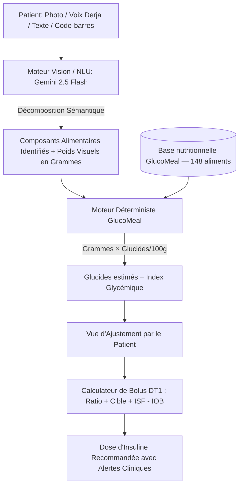

# 🥗 GlucoMeal.ai — Intelligence Artificielle & Diabétologie de Précision

> **Moteur hybride d'estimation des glucides par IA vision/voix et calcul déterministe des glucides pour Diabétiques de Type 1 (DT1), spécialement calibré pour la gastronomie tunisienne et méditerranéenne.**

[](https://glucomeal-ai.vercel.app/)
[](#-avertissement-médical--réglementaire)
[](#)
[](#)
[](#)
[](#)
[](#)
[](#-tests--assurance-qualité)
[](#)

> [!CAUTION]
> GlucoMeal.ai est un **outil expérimental d'aide au comptage des glucides**. Ce **n'est pas un dispositif médical certifié** (aucun marquage CE ni enregistrement réglementaire). Les estimations doivent toujours être vérifiées, et toute dose d'insuline reste sous la responsabilité du patient et de son équipe soignante. Voir l'[avertissement complet](#-avertissement-médical--réglementaire).

---

## 📋 Sommaire

1. [Aperçu & Défi Clinique](#-aperçu--défi-clinique)
2. [L'Approche Hybride : Pourquoi Déterministe ?](#-lapproche-hybride--pourquoi-déterministe-)
3. [Fonctionnalités Principales](#-fonctionnalités-principales)
   - [4 Modalités de Saisie Multimodale](#1-quatre-modalités-de-saisie-multimodale)
   - [Ajustement Précis des Portions](#2-ajustement-précis-des-portions--validation)
   - [Calculateur de Bolus d'Insuline Sécurisé](#3-calculateur-de-bolus-dinsuline-sécurisé)
   - [Intégration Continue du Glucose (CGM / Holter)](#4-intégration-continue-du-glucose-cgm)
   - [Suivi Postprandial & Auto-Titration Algorithmique](#5-suivi-postprandial--moteur-dauto-titration)
   - [Portail Médical & Diabétologue](#6-portail-médical--diabétologue-doctor-portal)
   - [Substitutions Saines & Éducation Thérapeutique](#7-substitutions-saines--conseils-nutritionnels)
   - [Banc d'Évaluation Interne](#8-banc-dévaluation-interne-non-certifié)
   - [Exports Excel & Dossier Médical](#9-exports-cliniques-excel--rapport-pdf)
   - [Synchronisation Cloud & Télé-surveillance Parentale](#10-synchronisation-cloud--télé-surveillance)
4. [Architecture Technique & Stack](#-architecture-technique--stack)
5. [Structure du Projet](#-structure-du-projet)
6. [Installation & Démarrage](#-installation--démarrage)
7. [Variables d'Environnement](#-variables-denvironnement)
8. [Référence des Endpoints API](#-référence-des-endpoints-api)
9. [Tests & Assurance Qualité](#-tests--assurance-qualité)
10. [Sécurité & Règles Firestore](#-sécurité--règles-firestore)
11. [Confidentialité & Consentement](#-confidentialité--consentement)
12. [Avertissement Médical & Réglementaire](#-avertissement-médical--réglementaire)

---

## 🎯 Aperçu & Défi Clinique

Pour une personne atteinte de **Diabète de Type 1 (DT1)**, le comptage des glucides au gramme près avant chaque repas conditionne la dose d'insuline rapide injectée (bolus prandial). Une erreur de calcul entraîne :
- **Sous-estimation** $\rightarrow$ Hyperglycémie postprandiale sévère, fatigue, acidocétose à long terme.
- **Sur-estimation** $\rightarrow$ Hypoglycémie aiguë iatrogène potentiellement fatale.

En **Tunisie et au Maghreb**, les personnes diabétiques font face à un défi supplémentaire majeur :
- Les plats traditionnels (*Couscous, Lablabi, Ojja, Brik à l'œuf, Mlawi, Tajine tunisien, Chorba, Makroudh, Assida Zgougou...*) sont préparés de manière artisanale, sans étiquetage nutritionnel.
- Les féculents sont souvent masqués ou immergés (*pain rassis dans le bouillon du Lablabi, semoule sous les légumes et la viande du Couscous*).
- Les applications internationales ne disposent ni des recettes régionales, ni de la reconnaissance du dialecte tunisien (*Derja*), ni des tables de composition de l'**INNT** (Institut National de Nutrition et de Technologies Alimentaires de Tunis).

**GlucoMeal.ai** comble cette lacune critique en combinant la puissance de l'IA vision et voix avec un calcul déterministe des glucides à partir d'une base nutritionnelle documentée.

---

## 🛡️ L'Approche Hybride : Pourquoi Déterministe ?

> [!IMPORTANT]
> **Règle d'or de sécurité médicale :** Les modèles de langage (LLM) sont sujets à des hallucinations statistiques et ne doivent **JAMAIS** calculer directement les grammes de glucides d'un patient diabétique.


```mermaid
flowchart TD
    A[Patient: Photo / Voix Derja / Texte / Code-barres] --> B[Moteur Vision / NLU: Gemini 2.5 Flash]
    B -->|Décomposition Sémantique| C[Composants Alimentaires Identifiés + Poids Visuels en Grammes]
    C --> D[Moteur Déterministe GlucoMeal]
    E[(Base nutritionnelle GlucoMeal — 148 aliments)] --> D
    D -->|Grammes × Glucides/100g| F[Glucides estimés + Index Glycémique]
    F --> G[Vue d'Ajustement par le Patient]
    G --> H[Calculateur de Bolus DT1 : Ratio + Cible + ISF - IOB]
    H --> I[Dose d'Insuline Recommandée avec Alertes Cliniques]
```

1. **L'IA (Gemini 2.5 Flash) s'occupe de la perception :** Elle identifie visuellement les aliments constitutifs de l'assiette et estime les volumes en grammes.
2. **Le moteur déterministe calcule les glucides :** Chaque composant est rapproché de la base nutritionnelle de GlucoMeal (148 aliments, valeurs inspirées des tables INNT / CIQUAL). Un composant absent de la base ou dont le poids estimé est hors bornes (5 à 1500 g) est marqué en confiance faible, avec une note invitant à vérifier :
   $$\text{Glucides (g)} = \frac{\text{Poids confirmé (g)} \times \text{Teneur aux 100g}}{100}$$
3. **La précision dépend de l'estimation des poids par l'IA**, qui reste la principale source d'erreur : la formule est exacte, pas le poids.
4. **Le patient garde le contrôle complet :** Un écran d'ajustement interactif permet de corriger immédiatement le poids de chaque composant avant la validation.

---

## 🚀 Fonctionnalités Principales

### 1. Quatre Modalités de Saisie Multimodale

| Mode | Description | Cas d'Usage |
|---|---|---|
| 📸 **Photo / Caméra** | Prise de vue sous angle à 45° ou zénithal (90°). Détection multi-composants instantanée via Gemini 2.5 Flash. | Repas complets, assiettes familiales, restaurants. |
| 🎙️ **Voix en Derja Tunisienne** | Saisie vocale avec compréhension du dialecte tunisien (ex: *"Sahn couscous bel khadhra w lham djeja w gazouza sghira"*). | Repas pris sur le pouce, enfants, personnes âgées. |
| ⌨️ **Saisie Texte Naturel** | Description libre en français ou arabe avec extraction automatique des quantités. | Repas simples ou corrections manuelles rapides. |
| 🏷️ **Code-Barres & OCR Étiquette** | Scanner ZXing (Open Food Facts) + **OCR d'étiquettes nutritionnelles par IA** pour produits locaux ou artisanaux sans code-barres. | Biscuits, yaourts, conserves, canettes, snacks industriels. |

---

### 2. Ajustement Précis des Portions & Validation

- **Interface tactile à curseurs et boutons pas-à-pas** pour chaque ingrédient.
- **Unités familières intégrées** : cuillères à soupe, louches, morceaux de pain, bols, canettes, etc.
- **Calcul instantané en direct** du total en glucides et de l'indice de confiance.
- **Rappels contextuels** : avertissement si un féculent riche à index glycémique élevé est détecté (*pic glycémique précoce ou tardif*).

---

### 3. Calculateur de Bolus d'Insuline Sécurisé

Formules classiques d'insulinothérapie fonctionnelle (recommandations **SFD** et **ADA**), à paramétrer avec le diabétologue :
- **Profil DT1 personnalisé** :
  - Ratios glucidiques par tranche horaire (*Matin, Midi, Goûter, Soir*).
  - **Prise en compte du Ramadan** (*Iftar, Sahriya, Shor*).
  - Facteur de Sensibilité à l'Insuline (**ISF**).
  - Glycémie cible et seuils d'hyper/hypoglycémie.
  - Durée d'action de l'insuline et insuline résiduelle active (**IOB**).
- **Formule de Bolus à 2 composantes** :
  $$\text{Bolus Repas} = \frac{\text{Glucides (g)}}{\text{Ratio (g/UI)}}$$
  $$\text{Bolus Correction} = \frac{\text{Glycémie Actuelle} - \text{Glycémie Cible}}{\text{ISF}}$$
  $$\text{Dose Totale} = \max\left(0, \text{Bolus Repas} + \text{Bolus Correction} - \text{IOB}\right)$$
- **Garde-fous** : aucun bolus n'est proposé en hypoglycémie ou sans glycémie fiable ; la correction devient négative sous la cible ; la dose est plafonnée (20 UI adulte, 10 UI enfant, configurable) et les paramètres hors bornes cliniques sont refusés.

---

### 4. Intégration Continue du Glucose (CGM)

Support étendu des capteurs de glycémie en continu :
- **Abbott FreeStyle Libre 2 & 3** : Scan NFC direct sur smartphone, intégration LibreLinkUp Cloud API.
- **Dexcom G7 / ONE** : Synchronisation Dexcom Share API.
- **Nightscout Open Protocol** : Connexion passerelle Nightscout (URL + Token).
- **Capteurs Asiatiques & Alternatifs** : Sibionics GS1 / SiBio, Linx, Sinocare, MicroTech.
- **Indicateurs AGP** : Glycémie en temps réel, flèche de tendance ($\uparrow\uparrow, \nearrow, \rightarrow, \searrow, \downarrow\downarrow$), et Temps dans la Cible (TIR 70-180 mg/dL).

---

### 5. Suivi Postprandial & Moteur d'Auto-Titration

- **Bannière de rappel automatique à H+2** après chaque repas validé.
- Enregistrement de la glycémie postprandiale (idéalement 1.20 - 1.80 g/L).
- **Moteur d'Auto-Titration Clinique** :
  - Analyse des 14 derniers jours par créneau horaire, uniquement sur les repas calculés avec le ratio actuel et dont le bolus n'a pas été bloqué.
  - Au moins 5 contrôles à H+2 sont nécessaires pour proposer une augmentation (au plus +10 %) ; une diminution est proposée dès 2 hypoglycémies.
  - Des résultats contradictoires (hypo et hyper sur le même créneau) ne donnent lieu à aucune proposition.
  - Toute proposition est à **valider avec le diabétologue** : l'application demande une confirmation explicite avant de modifier un ratio.

---

### 6. Portail Médical & Diabétologue (Doctor Portal)

- Vue de consultation **en lecture seule** : elle ne modifie jamais le profil d'insuline (les ratios se modifient dans le profil DT1, sur prescription).
- Synthèse des glycémies post-prandiales et pistes de titration à discuter.
- Historique complet des repas corrélés avec les doses d'insuline injectées et les glycémies à 2 heures.
- Espace de saisie pour notes de consultation.

---

### 7. Substitutions Saines & Conseils Nutritionnels

- Pour chaque repas analysé, le système propose des alternatives culturelles à index glycémique modéré sans altérer le plaisir culinaire :
  - Remplacement de la baguette blanche par du *Pain Tabouna complet* ou *Kesra d'orge (Khobz chîir)*.
  - Augmentation de la part de légumes cuits vapeur dans le couscous pour ralentir la vidange gastrique.
  - Remplacement des sodas réguliers par de l'eau aromatisée au citron ou soda zéro.

---

### 8. Banc d'Évaluation Interne (non certifié)

GlucoMeal intègre un banc d'évaluation interne pour mesurer l'écart entre les glucides estimés et des valeurs de référence. Il ne s'agit **ni d'une certification ni d'une validation clinique** (la norme ISO 15197 concerne les lecteurs de glycémie et ne s'applique pas ici) :
- **Dataset** : repas tunisiens dont les valeurs de référence sont calculées à partir de la base nutritionnelle ; une partie des repas est constituée de **variantes synthétiques** (signalées comme telles), et non de repas pesés.
- **Aucune simulation** : seuls les repas réellement analysés (prédiction fournie) sont évalués ; le rapport indique la taille du dataset et le nombre de repas non évalués.
- **Métriques calculées** :
  - **MAE** (Mean Absolute Error en grammes).
  - **RMSE** (Root Mean Square Error).
  - **MRE / MPE** (Pourcentage moyen d'erreur relative).
  - **Taux de conformité clinique** ($\le 15\%$ d'écart relatif, cible $\ge 85\%$).
  - **Déviation moyenne en unités d'insuline rapide** (cible $\le 0.8$ UI).
- **Live Vision Tester** : envoi d'une vraie photo du plat (obligatoire) au même pipeline que l'application, puis comparaison avec la référence.
- **Rapport d'évaluation interne imprimable** (non certifié) et export des données en CSV / JSON.

---

### 9. Exports Cliniques (Excel & Rapport PDF)

- **Export Excel (.xlsx)** : Feuille de calcul stylisée et formatée avec les repas, glucides, bolus, glycémies pré/postprandiales et moyennes statistiques pour transmission au diabétologue.
- **Rapport Médical Imprimable** : Génération d'une fiche clinique mise en page pour impression papier ou export PDF lors des visites hospitalières.

---

### 10. Synchronisation Cloud & Télé-surveillance

- **Fonctionnement Offline First (PWA)** : Données persistées localement via IndexedDB / LocalStorage et Service Worker (cache versionné à chaque build).
- **Synchronisation Cloud Firestore (facultative)** : uniquement si l'utilisateur l'a acceptée dans l'écran de consentement ou en créant un compte ; désactivable dans Profil > Confidentialité.
- **Code de partage patient/famille** : code aléatoire de 80 bits (`GLUCO-XXXX-XXXX-XXXX-XXXX`), valable 7 jours, modifiable uniquement par le compte qui l'a créé. Les repas sont restaurés ; les paramètres d'insuline reçus ne sont appliqués qu'après confirmation explicite et contrôle des bornes cliniques. Les secrets d'appareil (clé Nightscout) ne sont jamais partagés.

---

## 🛠️ Architecture Technique & Stack

| Couche | Technologies |
|---|---|
| **Frontend UI** | React 19, TypeScript 5.8, Tailwind CSS v4, Motion, Lucide Icons, Recharts |
| **PWA & Offline** | Service Worker (`sw.js`), Manifest Web App, IndexedDB / LocalStorage, Persistent Cache |
| **Backend & API** | Node.js, Express, Vercel Serverless Function (`api/index.js`), esbuild |
| **Moteur IA** | Google Gen AI SDK (`@google/genai`), modèle configurable (`GEMINI_MODEL`, défaut `gemini-2.5-flash`) avec repli facultatif (`GEMINI_FALLBACK_MODEL`) et délai maximal |
| **Base de Données & Auth** | Firebase Cloud Firestore, Firebase Auth (Anonyme & Email), Firebase Storage, App Check |
| **Sécurité & Règles** | Limiteur de requêtes par IP, CORS restreint, en-têtes HTTP (CSP, HSTS, Permissions-Policy) dans `vercel.json`, règles `firestore.rules` et `storage.rules` testées sur émulateur |
| **Scanner & Code-barres** | ZXing Browser (`@zxing/browser`, `@zxing/library`), Open Food Facts API |
| **Tests & Qualité** | Vitest 5, `@firebase/rules-unit-testing` (émulateurs), TypeScript (`tsc --noEmit`) |
| **Déploiement** | Vercel (SPA statique + fonction serverless `api/index.js`) |

---

## 📂 Structure du Projet

```text
GlucoMeal.ai/
├── api/                        # Fonction serverless Vercel
│   └── index.js                # Généré par « npm run build:api » à partir de server.ts (ne pas modifier)
├── server/                     # Modules du backend
│   ├── analysis.ts             # Analyse photo, texte/voix et étiquette (Gemini + calcul des glucides)
│   ├── barcode.ts              # Recherche Open Food Facts
│   ├── gemini.ts               # Client Gemini, modèle/repli/délai, validation des images
│   ├── localParser.ts          # Analyse locale du texte quand l'IA est indisponible
│   └── mealItems.ts            # Rapprochement avec la base, bornes de portion, confiance
├── tests/rules/                # Tests des règles Firestore et Storage (émulateurs)
├── public/                     # Assets statiques, manifeste PWA et Service Worker
│   ├── favicon.ico
│   ├── icon.svg
│   ├── manifest.json
│   └── sw.js
├── src/
│   ├── components/             # Composants React modulaires
│   │   ├── AuthScreen.tsx              # Écran de connexion/inscription patient & parent
│   │   ├── AutoTitrationModal.tsx      # Moteur d'ajustement algorithmique des ratios
│   │   ├── BarcodeModal.tsx            # Scanner de code-barres & OCR d'étiquettes
│   │   ├── BenchmarkView.tsx           # Banc d'évaluation interne (repas réellement analysés)
│   │   ├── BottomNav.tsx               # Navigation mobile ergonomique
│   │   ├── CGMSyncModal.tsx            # Gestion des capteurs FreeStyle / Dexcom / Sibionics
│   │   ├── CloudSyncModal.tsx          # Télé-surveillance et synchronisation multi-appareils
│   │   ├── ConsentScreen.tsx           # Consentement aux données de santé (cloud et audience facultatifs)
│   │   ├── DoctorPortalView.tsx        # Portail praticien / diabétologue sécurisé
│   │   ├── FoodDatabaseView.tsx        # Consultation de la base alimentaire tunisienne
│   │   ├── Header.tsx                  # En-tête applicatif avec statut CGM & sélecteur de langue
│   │   ├── HealthySubstitutionsCard.tsx# Suggestions de substitutions à bas index glycémique
│   │   ├── HistoryView.tsx             # Journal des repas et graphiques nutritionnels
│   │   ├── HomeMealEntry.tsx           # Tableau de bord principal & boutons d'entrée
│   │   ├── LandingPageView.tsx         # Page d'accueil & présentation clinique
│   │   ├── LanguageSwitcher.tsx        # Sélecteur de langue (FR / AR / EN)
│   │   ├── LiveVisionTester.tsx        # Banc d'essai live de vision par IA
│   │   ├── MealValidationSuccess.tsx   # Écran de confirmation de repas enregistré
│   │   ├── MedicalReportModal.tsx      # Fiche clinique et rapport médical imprimable
│   │   ├── MetrologicalAuditModal.tsx  # Rapport d'évaluation interne (non certifié)
│   │   ├── PhotoInputModal.tsx         # Prise de photo ou téléversement d'assiette
│   │   ├── PortionAdjustmentView.tsx   # Ajustement tactile des portions & calcul bolus
│   │   ├── PostPrandialEntryModal.tsx  # Enregistrement de la glycémie à 2h
│   │   ├── PostPrandialReminderBanner.tsx # Alerte de contrôle postprandial
│   │   ├── PrivacyPolicyModal.tsx      # Politique de confidentialité (FR / AR)
│   │   ├── PWAInstallBanner.tsx        # Bannière d'installation mobile
│   │   ├── PWAInstallModal.tsx         # Guide d'installation iOS / Android
│   │   ├── TextInputModal.tsx          # Saisie en langage naturel
│   │   ├── UserProfileModal.tsx        # Configuration du profil thérapeutique DT1
│   │   └── VoiceInputModal.tsx         # Reconnaissance vocale en Derja tunisienne
│   ├── data/                   # Données nutritionnelles & datasets cliniques
│   │   ├── benchmarkDataset.ts         # Dataset de référence initial
│   │   ├── sampleMeals.ts              # Photos et repas de démonstration
│   │   ├── technicalSpecs.ts           # Spécifications d'architecture médicale
│   │   ├── tunisianBenchmarkDataset.ts # Dataset étendu de cuisine tunisienne
│   │   └── tunisianFoodDatabase.ts     # Base nutritionnelle (148 aliments, inspirée INNT / CIQUAL)
│   ├── i18n/                   # Trilingue (Français, Arabe/Tunisien, Anglais)
│   │   ├── LanguageContext.tsx
│   │   └── translations.ts
│   ├── services/               # Services externes
│   │   └── firebase.ts                 # Client Firebase Auth, Firestore, Storage & App Check
│   ├── types/                  # Définitions TypeScript
│   │   ├── benchmark.ts                # Types pour l'évaluation métrologique
│   │   └── index.ts
│   ├── utils/                  # Algorithmes métiers & utilitaires
│   │   ├── __tests__/                  # Tests unitaires Vitest (bolus, titration, CGM, consentement…)
│   │   ├── activeLearning.ts           # Système d'apprentissage actif sur corrections
│   │   ├── autoTitration.ts            # Moteur mathématique d'auto-titration DT1
│   │   ├── benchmarkEvaluator.ts       # Calculateur MAE, RMSE, Clarke Error Grid
│   │   ├── benchmarkExporter.ts        # Export CSV et JSON de benchmark
│   │   ├── cgmService.ts               # Drivers & protocoles CGM (FreeStyle, Dexcom, SiBio)
│   │   ├── cloudSync.ts                # Synchronisation télémétrique multi-appareils
│   │   ├── consent.ts                  # Consentement versionné (cloud et audience)
│   │   ├── excelExport.ts              # Générateur de feuilles Excel (.xlsx) stylisées
│   │   ├── h2Reminder.ts               # Planificateur d'alertes postprandiales
│   │   ├── healthySubstitutions.ts     # Algorithme de recommandation d'alternatives
│   │   └── storage.ts                  # Persistance locale sécurisée et assainissement
│   ├── App.tsx                 # Composant racine et orchestrateur de flux
│   ├── main.tsx                # Point de montage React
│   └── types.ts                # Modèles de données globaux
├── firestore.rules             # Règles de sécurité Firestore
├── storage.rules               # Règles de sécurité Storage (photos de repas)
├── index.html                  # Fichier HTML principal & PWA meta
├── package.json                # Dépendances et scripts de build
├── server.ts                   # Serveur Express & API Gemini (Backend)
├── tsconfig.json               # Configuration TypeScript
├── metadata.json               # Métadonnées Google AI Studio (conservé pour l'import dans AI Studio)
├── vercel.json                 # Routage, build et en-têtes de sécurité Vercel
├── vite.config.ts              # Configuration Vite & Tailwind v4
├── vitest.config.ts            # Configuration des tests unitaires
└── vitest.rules.config.ts      # Configuration des tests de règles (émulateurs)
```

---

## 💻 Installation & Démarrage

### Prérequis
- [Node.js](https://nodejs.org/) v18 ou supérieur (v20+ recommandé)
- [npm](https://www.npmjs.com/) ou [bun](https://bun.sh/)
- Une clé API [Google AI Studio (Gemini API)](https://aistudio.google.com/)

### 1. Cloner le Dépôt
```bash
git clone https://github.com/mormox2/GlucoMeal.ai.git
cd GlucoMeal.ai
```

### 2. Installer les Dépendances
```bash
npm install
```

### 3. Configurer l'Environnement
Créez un fichier `.env` à la racine en vous basant sur `.env.example` :
```env
GEMINI_API_KEY="votre_cle_gemini_api_ici"
APP_URL="http://localhost:3000"
PORT=3000
```

### 4. Lancer en Mode Développement
Le serveur unifié lance à la fois le backend Express et le middleware Vite :
```bash
npm run dev
```
Ouvrez votre navigateur sur `http://localhost:3000`.

### 5. Compiler pour la Production
```bash
npm run build
```
Cette commande compile le frontend Vite dans `/dist` puis régénère `api/index.js` à partir de `server.ts` (`npm run build:api`). Vercel exécute la même commande. Ne modifiez jamais `api/index.js` à la main : relancez `npm run build:api` et commitez le résultat.

---

## 🔐 Variables d'Environnement

| Variable | Requis | Description |
|---|---|---|
| `GEMINI_API_KEY` | **Oui** | Clé API Google Gemini (analyse photo, texte et étiquettes). |
| `GEMINI_MODEL` | Non | Modèle Gemini principal (défaut `gemini-2.5-flash`). |
| `GEMINI_FALLBACK_MODEL` | Non | Modèle de repli essayé si le principal échoue (aucun par défaut). |
| `GEMINI_TIMEOUT_MS` | Non | Délai maximal d'un appel Gemini en ms (défaut `25000`). |
| `ALLOWED_ORIGINS` | Non | Origines autorisées par CORS, séparées par des virgules (défaut `https://glucomeal-ai.vercel.app` ; le même hôte est toujours autorisé). |
| `TRUST_PROXY` | Non | Nombre de proxys de confiance pour l'IP client du limiteur (défaut `1` sur Vercel, désactivé sinon). |
| `APP_URL` | Non | URL canonique de l'application (ex: `https://glucomeal.ai`). |
| `PORT` | Non | Port d'écoute du serveur local (par défaut `3000`). |
| `VERCEL` | Auto | Détecte l'exécution en environnement Vercel Serverless. |
| `VITE_RECAPTCHA_SITE_KEY` | Recommandé | Clé de site reCAPTCHA v3 pour Firebase App Check. Sans elle, App Check est désactivé. |
| `VITE_APPCHECK_DEBUG_TOKEN` | Non | Jeton de débogage App Check, pour le développement local uniquement. |

*Note : la configuration Firebase côté client (clés publiques) est dans `firebase-applet-config.json`.*

### Sécurité Firebase (à faire dans la console)

1. **Déployer les règles** après chaque modification : `firebase deploy --only firestore:rules,storage`.
2. **App Check** : enregistrer l'application web avec reCAPTCHA v3 (console Firebase > App Check), renseigner `VITE_RECAPTCHA_SITE_KEY`, vérifier les métriques, puis activer l'application obligatoire (« Enforce ») pour Firestore et Storage.
3. **TTL Firestore** : créer une politique d'expiration sur le champ `expiresAt` de la collection `syncCodes`.

### Nightscout

Utilisez un **jeton d'accès en lecture seule** (Nightscout > Admin Tools > rôle `readable`, ex. `lecture-1a2b3c4d5e6f7a8b`). L'`API_SECRET` est encore accepté (il est envoyé haché en SHA-1, jamais en clair), mais il donne un accès administrateur complet. Une mesure de plus de 15 minutes n'est jamais utilisée pour calculer un bolus.

---

## 🔌 Référence des Endpoints API

| Méthode | Endpoint | Description | Rate Limit |
|---|---|---|---|
| `GET` | `/api/health` | Vérification de l'état de santé du service | Illimité |
| `POST` | `/api/analyze-meal` | Analyse multimodale (photo, texte, voix, code-barres, OCR) | 30 req/min |
| `GET` | `/api/foods` | Recherche et consultation de la base nutritionnelle tunisienne | Illimité |
| `GET` | `/api/benchmark/dataset` | Dataset d'évaluation interne (indicateur `synthetic`) | Illimité |
| `POST` | `/api/benchmark/evaluate` | Évaluation des seules prédictions fournies (aucune simulation) | Illimité |
| `POST` | `/api/benchmark/live-vision` | Analyse d'une photo réelle (`imageBase64` obligatoire) d'un repas du dataset | 30 req/min |
| `*` | `/api/sync/*` | Retirée (410 Gone) : la synchronisation passe uniquement par Firestore | — |

En cas d'échec (IA indisponible, aliment ou code-barres inconnu, glucides illisibles), `/api/analyze-meal` renvoie une erreur explicite (`{ error, code }`, HTTP 4xx/5xx) et **jamais** une estimation de glucides par défaut. Principaux codes : `TEXT_MISSING`, `TEXT_TOO_LONG` (plus de 500 caractères), `INVALID_IMAGE` (JPEG, PNG, WebP ou HEIC uniquement), `NO_FOOD_RECOGNIZED`, `CARBS_UNREADABLE`, `AI_ERROR`, `SERVER_ERROR` (sans détail interne).

- **Texte et voix** : la description est envoyée à Gemini comme donnée, séparée des consignes (protection contre l'injection de consignes). Si l'IA est indisponible, un analyseur local reconnaît les plats de la base ; il ne renvoie rien plutôt qu'une valeur inventée.
- **CORS** : seules les origines autorisées (`ALLOWED_ORIGINS` et le même hôte) peuvent appeler l'API ; une requête préliminaire d'une autre origine reçoit 403.
- **En-têtes** : les réponses de l'API sont `no-store` et interdites en iframe ; le site applique la CSP et les en-têtes définis dans `vercel.json`.

---

## 🧪 Tests & Assurance Qualité

```bash
npm test            # 150 tests unitaires et d'API (Vitest)
npm run test:rules  # 6 tests des règles Firestore et Storage sur émulateurs (Java requis)
```

### Ce qui est testé :
- **Sécurité du calculateur de bolus** : unités de glycémie, blocage en hypoglycémie ou sans valeur fiable, bornes du profil, insuline active (IOB), plafond configurable (20 UI adulte, 10 UI enfant).
- **Moteur d'auto-titration** : fenêtre de 14 jours, minimum de 5 contrôles, ratio actuel uniquement, résultats contradictoires, ajustement limité à 10 %.
- **API d'analyse** : erreurs explicites sans glucides par défaut, analyseur local, bornes des portions, validation des images, séparation des consignes et de la saisie, repli de modèle, CORS et en-têtes.
- **Banc d'évaluation** : aucune prédiction simulée, identifiants uniques de la base.
- **CGM et BLE**, statistiques postprandiales, exports, consentement.
- **Règles de sécurité** : propriété et expiration des codes de partage, profil, et photos Storage (propriétaire, type, taille).

Vérification des types TypeScript :
```bash
npm run lint
```

---

## 🔒 Sécurité & Règles Firestore

La base de données Firebase Firestore est verrouillée par des règles d'accès strictes définies dans [`firestore.rules`](firestore.rules) et [`storage.rules`](storage.rules) :
- **Isolation des données patients** : Chaque utilisateur authentifié ne peut lire et modifier que ses propres repas et profils (`request.auth.uid == userId`).
- **Délégation médicale & parentale** : Accès en lecture autorisé aux comptes délégués enregistrés dans `/users/{userId}/delegates/{delegateId}`.
- **Validation stricte des schémas** : Plafond sur les glucides totaux (0 à 1000g), vérification des types de données, assainissement des chaînes de caractères.
- **Protection Anti-Abus** : Intégration de Firebase App Check (reCAPTCHA v3) pour empêcher l'accès aux bots.

---

## 🔏 Confidentialité & Consentement

- **Consentement explicite** (RGPD art. 9, loi tunisienne n° 2004-63) demandé avant toute utilisation : le traitement des données de santé et l'envoi des repas à Google Gemini sont obligatoires pour utiliser l'application ; la **sauvegarde cloud** et la **mesure d'audience** (Vercel Analytics) sont facultatives et désactivées par défaut.
- Le consentement est versionné (`src/utils/consent.ts`) : il est redemandé à chaque changement substantiel de la politique.
- **Profil > Confidentialité** : modifier ses choix, lire la politique, et **supprimer toutes ses données** (appareil, cache Firestore, repas, profil, codes de partage, photos Storage et compte Firebase).
- Les identifiants de capteurs (Nightscout, comptes CGM) restent sur l'appareil.

---

## ⚕️ Avertissement Médical & Réglementaire

> [!CAUTION]
> **Outil expérimental, non certifié comme dispositif médical**  
> GlucoMeal.ai n'a fait l'objet d'aucun marquage CE, d'aucune validation clinique ni d'aucun enregistrement auprès d'une autorité sanitaire. C'est un outil expérimental d'aide au calcul et à l'éducation thérapeutique pour le diabète de type 1. Il **ne remplace en aucun cas l'avis, le diagnostic ou la prescription d'un médecin diabétologue ou endocrinologue**.  
> Le patient doit toujours vérifier visuellement les portions suggérées et valider la dose d'insuline avant toute injection. En cas de doute ou de malaise, appliquez immédiatement le protocole de resucrage d'urgence prescrit par votre équipe soignante.

---

## 📄 Licence & Droits d'Auteur

Distribué sous licence **MIT**. Développé avec passion pour la communauté des personnes vivant avec le diabète de type 1 en Tunisie et dans le monde.
